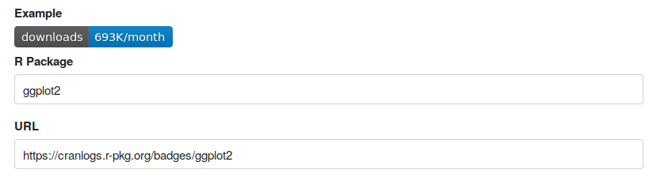
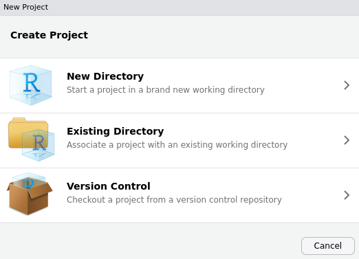

---

<!--img src="logo.svg" style="position:absolute;top:0px;right:0px;" /-->


## Coding Standards

This is the set of standards that Nicholson Consulting work should follow to create consistent and easy to maintain code. Most of our work is done in R so the coding standards provide more examples to reflect that.

### Style Guides
This is a well documented area already. For R we follow the [tidyverse](https://style.tidyverse.org/) style guide. 

Use the `formatR`to tidy up some of the [aesthetics](https://yihui.name/formatR) of your code.

```r
library(lintr)

#tidy up a whole directory
formatR::tidy_dir(getwd())
```

The `lintr` package confirms that you conform to the tidyverse standards.


```r
library(lintr)
lint("file.R")
```

For C\# we use [Microsoft's coding conventions](https://docs.microsoft.com/en-us/dotnet/csharp/programming-guide/inside-a-program/coding-conventions)

For PHP we use the [PRS-2 Coding Style Guideline](https://www.php-fig.org/psr/psr-2/)

All other languages we use follow [Google Style Guides](http://google.github.io/styleguide/)

### Good Coding Standards
Often data science teams are working on the deliver quickly vs deliver something that is maintainable dilemma. Delivering something that is maintainable allows you to work more quickly in the future because you can recycle work and the code is written in such a way that it is easy to troubleshoot if something breaks down the track.

Our standards are made to align with our SDLC. Code that is written by Nicholson Consulting is:

* modular and can be reused again
* is version controlled
* well documented
* has been tested
* and is efficiently written

More about how this is achieved is detailed below.

### Reusing Code
Before you begin a new project always check what is already out there. There is a good chance someone has already written code for what you want to do which can help speed up your development.

Our repository should always be checked prior to developing new code to see what can be recycled. The entire code based might be recycled or maybe it is just the structure or approach that is recycled. Note that we do work for clients who sometimes publish the code on their own [GitHub account](https://github.com/nicholson-consulting). You can find these repositories [here](https://github.com/nicholson-consulting/related-repos).

When developing new code look at making it as reusable as possible so that future projects can benefit from it.

There are many packages in R that save you having to type up code. Look for packages that are in CRAN or on GitHub. There are several factors that you should consider before you go and use someone else code

* When was the last release? If it was a while ago and something goes wrong, chances are it won't be fixed any time soon.
* How many contributors are there? The more contributors the more people have developed the code so hopefully there are fewer bugs.
* Is there an active community around this package? GitHub is a good place to check. How many issues are being raised etc. A Google search on blogs regarding the package might also be useful to gauge how large the community is
* How many downloads of the package are there? Projects with many downloads are usually well maintained. [CRAN download counts](https://cranlogs.r-pkg.org/) can tell you how many downloads there were each month. An example is shown below

<div class="jumbotron">


</div>
### Version Control
All code should be versioned. Nicholson Consulting has its own [GitHub](https://github.com/nicholson-consulting) account. All repositories should be private to begin with and once written permission is obtained from the Technical Lead and the client they can be made public.

We created the Social Investment Agency [Version Control Standards](https://nz-social-investment-agency.github.io/sia_analytical_processes/output/git_version_control.html) so this is a great place to learn more about Git and version control.

We can also arrange specific training through Catalyst IT if you need it. Contact our People Experience Lead

In some situations the client may have their own version control system which we will use. Depending on the who owns the IP we may also sign the final version out and place it in a **private repository** with permission of the client for future reference.

### Documentation
This is also covered in many style guides but given the importance of reusable and maintainable code it warrants its own section

#### In Repository Documentation
All our GitHub repos should have a `README.md` file in the top level. This is the first place a person will go looking for instructions on what the repository should do. It should include as a minimum:

* The purpose of the repository
* Installation instructions including any dependencies (if applicable)
* Authors
* The license (GNU GPLv3 for code and CC-BY-SA for content by default with MIT and CC-BY respectively in some special cases). Talk to the Technical Lead if you are unsure which license you should apply
* Acknowledgements

An example of the README for this repo can be found [here](https://github.com/nicholson-consulting/coding-standards/blob/master/README.md).

#### In Code Documentation
##### Headers
Headers should contain some basic information An example is shown below


```r
#################################################################################
# DESCRIPTION: Examples of how to write R code that runs on CAS
#
# INPUT: NA
#
# OUTPUT: NA
#
# AUTHOR: EW
#
# DEPENDENCIES: 
# swat package must be installed
# authinfo file must contain credentials to connect to the server
# D:\Workshop\HOW\data\cas_crash.csv must exist
#
# NOTES:
# code is versioned and publicly available so the credentials have been ommited
# you will need to specify the server name and port number prior to running this
#
# HISTORY:
# 13 Apr 2019 EW updated after testing on image
# 12 Feb 2019 EW v1
#################################################################################
```

Ideally, this example should have Roxygen comments in it. More info below.

##### Roxygen
Use Roxygen to automatically generate the documentation. An example of Roxygen comments is shown below. 


```r
#' Nicholson Consulting brand fill colours
#'
#' This is a function for adding fill to ggplot that aligns with NC brand colours kikorangi (blue scale), kowhai (yellow scale), kiwkiwi (gray scale),
#' makiwikiwi (light gray scale) or whero (red scale)
#' @keywords plot ggplot fill 
#' @usage 
#' nc.plot.fill.core()
#' nc.plot.fill.kikorangi()
#' nc.plot.fill.kowhai()
#' nc.plot.fill.kiwikiwi()
#' nc.plot.fill.makiwkikiwi()
#' nc.plot.fill.whero()
#' @export
#' @examples
#' library(ggplot2)
#' library(ncrpackage)
#'
#' ggplot(mtcars, aes(mpg, wt, colour = as.factor(cyl))) +
#' geom_point() +
#' ggtitle("Fuel economy data)") +
#' nc.plot.theme() +
#' nc.plot.fill.core()
```
The `*.Rd`, and `NAMESPACE` files can then be built using `devtools::document()` or `roxygen2::roxygenize()`.

For more information on how to use Roxygen see [here](http://r-pkgs.had.co.nz/man.html) 

##### Comments
Comments in the code should be information and explain why you are doing something not what you are doing. 

Large sections can be sectioned off by using a series of \# symbols


```r
#################################################################################
# New section
#################################################################################
```
### Project Creation
A project is a working directory. It will create a `.Rproj` file that can be used to open all your scripts back up. The benefits of projects are that they save you mucking around with long path names when you go to set a working directory (which may be different for each person working on the project as well) and they don't have history clutter from a previous project. The latter is very important when other people go to run your code. You may have a variable existing in your history that other people don't so the code might not run when they try it.

Under the `File` menu you can click on `New Project...` or on `Open Project...` for existing projects.

<div class="jumbotron">


</div>

Projects can also be tied to a version control repository making good coding practice easier.

Using `devtools` alongside your package can be a helpful way to automatically generate the documentation, perform testing and other good practices.

### Testing
Code that is tested is more dependable and it is easier to maintain. There are many methods of testing.

#### Human Feedback
Code that is made for a client should be peer reviewed by a colleague before finalsing deliverables. During this review the person is looking for whether or not the code does what is expected and how well it complies with the coding standards.

User acceptance tests are also another great way to get feedback from SMEs who can tell you whether or not your results are what you expected. When working on the automated cover decisions we took a sample of the decisions done on a hold out dataset and asked the SMEs whether they agreed with the decisions. The type of acceptance test can vary depending on what the outputs are from is this what I expect to look at on a dashboard through to does this tabular output look right.

#### Programatic Testing
Code that is intended for more generic use should be more thoroughly tested. A test driven development approach is preferred where you write the tests that the code will pass then write the code. The code will be more streamlined and maintainable that way.

The code should be unit tested. The `testthat` package provides the ability to do unit tests.

```r
library(testthat)
test_check('package_name')
```
Alternatively `devtools::test()` will run all the tests in a package.

An example of writing the actual test can be found [here](https://dzone.com/articles/example-unit-testing-r-code)

Where available, use a continuous integration tool like Jenkins to do automated builds that can check for test failures before you deploy code.

To see how much of the code is executed during testing you can use the `covr` package.


```r
library(covr)
coverage_to_list()
```

### Performance
Writing code that runs well is often traded off against work that is delivered on time. These questions can help you find the balance between well written code and code that is quickly delivered

* Will the code be used often? If so more time should be spent on improving performance. It will take longer initially but will have long term benefits
* How long does the code take to run. If the code takes a day to run but you need the results by lunch time then you should look at improving performance
* Are colleagues complaining that your poorly written code consumes all available resources? If you are impacting on other people's work that is another sign that you should run your code outside of work hours or re-write it to run during the day.

There are many different ways you can improve performance as well

* If you have too many for loops then vectorise
* If the for loops cannot be avoided then use `Rcpp`
* If you have recursive functions with many calls then use `Rcpp`
* If you cant see the initial body neck then try the memory profiling tools
* For repetitive tasks look at parallel computing 

#### Vectorise
Avoid for loops where possible. They are very slow. There are functions that are vectorised which apply the entire operation across the vector such as `lapply`.

#### Memory
Behind the scenes, R might be creating copies of objects which can consume a lot of memory and slow the execution of code down. Use the `lineprof` package to do memory profiling and identify bottlenecks using a nice visual interface.


```r
library(lineprof)


mem_prof <- lineprof(code)
shine(mem_prof)
```

#### The Rcpp package
When the R code is too slow it might be worth rewriting the code in C++. This can be done using the Rcpp package. An example of using the `Rcpp` package can be found [here](https://support.rstudio.com/hc/en-us/articles/200486088-Using-Rcpp-with-RStudio).

#### Parallel Computing
Things like simulations or applying the same type of analysis on different cohorts or different sets of variables could potentially be run in parallel. Packages like `parallel` can be used to carry out parallel computing. Be mindful of how many cores you have available and who you have to share the sever with. Make sure there is enough resource available for other users as well. 


