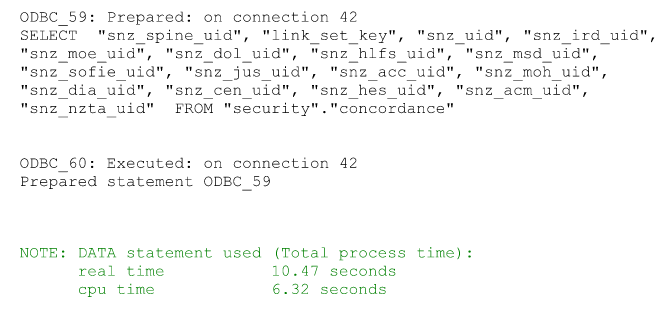
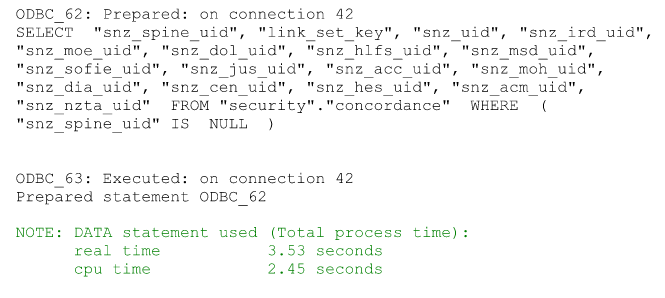

---

<!--img src="logo.svg" style="position:absolute;top:0px;right:0px;" /-->


## IDI Standards

This is the markdown rendered version of a presentation that Ernestynne Walsh gave at SUNZ 2017 on how to use R, SQL and SAS efficiently in the IDI. The `.Rmd` file can be dropped into an IDI project so that the code snippets can easily be copied when needed.

### Process in database
Tip 1: It is faster to process the data in the database and return a subset of the results rather than copy all the data over to SAS and subset. Use an explicit pass through as shown below. An internal pass-through may sometimes copy the whole table over if you are not aware of how they work.


```sas
/* pass the query to the database to be executed */
/* this particular example is an explicit pass through */
proc sql;
  connect to sqlservr (server = XXXX);
  create table work.msd_t1 as
      select * from connection to sqlservr(
      select
          [snz_uid]
          ,[msd_fte_serv_code]
          ,[msd_fte_srvst_code]
          ,[msd_fte_start_date]
          ,[msd_fte_end_date]
          ,[msd_fte_daily_nett_amt]
      from [IDI_Clean].[msd_clean].[msd_first_tier_expenditure]
      where year([msd_fte_start_date]) = 2016
      )
  ;
quit;
```

### Test code on a subset of data first
Tip 2: Nothing is worse then leaving your code running for a long time, only to come back and find you have to run it again because you have an entire column that is blank or some other problem. Returning a subset of the data using `top` will give you results faster so you can check the data looks ok before you run the entire query


```sas
/* only return the top 100 rows so you can check your output looks
right before running the whole query only to find you have made a mistake */
  
proc sql;
  connect to sqlservr (server = XXXX);
  create table work.msd_t1 as
      select * from connection to sqlservr(
      select top 100
          [snz_uid]
          ,[msd_fte_serv_code]
          ,[msd_fte_srvst_code]
          ,[msd_fte_start_date]
          ,[msd_fte_end_date]
          ,[msd_fte_daily_nett_amt]
     from [IDI_Clean].[msd_clean].[msd_first_tier_expenditure]
     where year([msd_fte_start_date]) = 2016
     )

;
quit;
```

### What implementation of SQL are you using?
Tip 3: Different implementations of SQL do things slightly differently. The example below highlights that functions have different names (`substring` vs `substr`) and that SAS column names truncate at 32 characters (e.g. `acc_cla_wilful_self_inflicted_st`). It is best to use MS SQL to select top 100 from a table and then edit the query as needed. When you are done you can copy and paste it into your explicit pass through.


```sas
/* MS SQL */
proc sql;
  connect to sqlservr (server = XXXX);
  create table work.acc as
      select * from connection to sqlservr(
      select
          [snz_uid]
          ,[acc_cla_accident_date]
          ,substring(acc_cla_scene_text,1,10) as acc_scene
          ,[acc_cla_wilful_self_inflicted_status_text]
      from [IDI_Clean].[acc_clean].[claims]
      where year([acc_cla_accident_date]) = 2015
      )

;
quit;

/* SAS SQL */
proc sql;
  connect to sqlservr (server = XXXX);
  create table work.acc as
      select
          snz_uid
          ,acc_cla_accident_date
          ,substr(acc_cla_scene_text, 1, 10) as acc_scene
          ,acc_cla_wilful_self_inflicted_st
      from connection to sqlservr(
          select
              [snz_uid]
              ,[acc_cla_accident_date]
              ,[acc_cla_scene_text]
              ,[acc_cla_wilful_self_inflicted_status_text]
          from [IDI_Clean].[acc_clean].[claims]
          where year([acc_cla_accident_date]) = 2015
      )
;
quit;
```

### Use the Trace
Tip 4: The trace will allow you to see what code is running behind the scenes. This is good way to see whether or not you are processing the code in the database or copying over an entire table 


```sas
/* details from the trace */
options sastrace=',,,d'; sastraceloc=saslog nostsuffix;

/* security - used mainly for concordance */
libname security ODBC dsn=idi_clean_archive_srvprd schema=security readbuff=30000;

/* dont use sas functions that arent supported in the database */
data inefficient_example;
  set security.concordance (where = (missing(snz_spine_uid))
  obs=1000000);
run;
```

This produces the following output

<div class="jumbotron">


</div>

Only use where clauses that are supported like `is NULL` and do not use the SAS `missing()` function.


```sas
/* use something that is supported */
data efficient_example;
  set security.concordance (where = (snz_spine_uid is null)
  obs=1000000);
run;
```

This produces the following output

<div class="jumbotron">


</div>

### Bulkload data
Tip 5: If you transfer data one row at a time it will be incredibly slow. Instead bulk load the data.


```sas
/* bulkload - insert data into the database quickly */
libname sand ODBC dsn= idi_sandpit_srvprd schema='DL-MAA2016-15';
bulkload=yes ;

/* bulkunload - fetch a large number of rows quickly*/
libname moh ODBC dsn=idi_clean_archive_srvprd schema=moh_clean
bulkunload=yes;

/* what else could we try if bulkloading and unloading isnt available */
libname sand ODBC dsn= idi_sandpit_srvprd schema='DL-MAA2016-15';
insertbuff=30000 readbuff=30000;
```

### Use R packages to interface with MS SQL server
Tip 6: You can read data directly from the database. Do not save a csv then read it into R. This query can be saved.


```sql
select
    snz_legacy_application_uid
    , appl_year_qtr
    ,[hnz_re_exit_status_text]
    ,case when [hnz_re_exit_status_text] = 'HOUSED' then 1 else 0 end as actual_class
    ,[hnz_na_main_reason_app_text]
from [IDI_Sandpit].[DL-MAA2016-15].sh_pop_0506 hh
    left join IDI_Clean_20160715.data.address_notification addr
    on (hh.primary_snz_uid =addr.snz_uid and
    hh.hnz_na_date_of_application_date between
    addr.[ant_notification_date] and
    addr.[ant_replacement_date])

```
and then used in R


```r
# implements ODBC database connectivity
library(RODBC);

# this is the sql query we created that retrieves the data we want
database_query <- file("~/path/to/file/get_data_from_database.sql", "r");
conn <- odbcDriverConnect(connection = "DRIVER=ODBC Driver 11 for SQL Server;
Trusted_Connection=Yes;
DATABASE=IDI_Sandpit ;
SERVER=XXXX, XXXX")

# this will submit the query to the specified connection and return the results
# these results are now available as a data frame in R
r_data.frame <- sqlQuery(channel = conn,
query = paste(readLines(database_query), collapse="\n"))

# save results back in the database
# save dataframe to the database
# note that this is pretty slow
sqlSave(channel = conn, dat = r_data.frame_pred, tablename = "database_table_pred",
rownames = FALSE, fast=TRUE)
odbcClose(conn)

# confirm the table is in the schema
sqlTables(conn, schema = "STATSNZ\\XX")

odbcClose(conn)
str(r_data.frame)
```
The sqlSave does not appear to do a bulk insert. The other option is to save as a csv then bulk insert back into the database which is a lot faster.


```sql
/* delete the table if it already exists*/
use IDI_Sandpit;
drop table [DL-MAA2016-15].database_table_pred_bulk_insert;
GO

/* create a shell for the data to go into */
create table [DL-MAA2016-15].database_table_pred_bulk_insert
([snz_legacy_application_uid] numeric(11),
[appl_year_qtr] varchar(6),
[hnz_re_exit_status_text] varchar(50),
[actual_class] tinyint,
[hnz_na_main_reason_app_text] varchar(250),
[prediction] float
);

bulk insert [DL-MAA2016-15].database_table_pred_bulk_insert
from '\\wprdfs08\path\to\file\database_table_pred.csv'
with(
datafiletype = 'char',
fieldterminator = ',',
rowterminator = '\n',
firstrow = 2)
go

/* confirm table looks correct */
select *
from [DL-MAA2016-15].database_table_pred_bulk_insert
```

Note that if you have saved a table into the wrong schema you can shift it in MS SQL Server

```sql

/* this is one way to shift the table to the project schema */
use IDI_Sandpit;
alter schema [DL-MAA2016-15] transfer
[STATSNZ\XXXX.[database_table_pred]
```

### Casting and Conversion
Tip 7: Use the correct data types so that you do not have to convert and cast.


```sas
/* the date type in sql gets converted into a character type in sas */
/* dont use */
proc sql;
  connect to sqlservr (server=WPRDSQL36\ileed);
  create table work.date_example as
      select *
      from connection to sqlservr(
          select top 100 [snz_uid]
          ,[moh_bsc_check_date]
         from [IDI_Clean].[moh_clean].[b4sc]
      );

quit;
      
/* datetimes are converted to numeric values in sas */
proc sql;
  connect to sqlservr (server=WPRDSQL36\ileed);
  create table work.datetime_example as
      select *
      from connection to sqlservr(
          select top 100 [snz_uid]
          ,[moh_nnp_event_type_code]
          ,[moh_nnp_service_datetime]
          from [IDI_Clean].[moh_clean].[nnpac]
      );

quit;
      
/* if you want your date to come through correctly then cast it */
proc sql;
  connect to sqlservr (server=WPRDSQL36\ileed);
  create table work.date_example as
      select snz_uid
      , input(moh_bsc_check_date, yymmdd10.) as moh_bsc_check_date format=ddmmyy10.
      from connection to sqlservr(
          select top 100 [snz_uid]
          ,[moh_bsc_check_date]
          from [IDI_Clean].[moh_clean].[b4sc]
      );

quit;
```

### Query plans and optimisation
Tip 8: Check where the bottle necks in your query lie by using `showplan`, `_method` and `_tree`


```sql
/* note that some administrators might not allow you to see the query plans */
set showplan_xml on;

SELECT TOP 1000 [Department]
,[Datamart]
,[Subject_Area]
,[start_date]
,[end_date]
FROM [IDI_Sandpit].[DL-MAA2016-15].[moe_school]
```


```sas
/* use _method and _tree options to understand how your query will run */
proc sql nowarn _method _tree;
  create table temp_w1d_w7_adults_health as
      select a.*
      ,h.*
      from temp_w1d_w7_adults a
      inner join temp_sofie_health h on
        a.snz_sofie_uid=h.snz_sofie_uid
      where ...
```


### Going between R and SAS 
Tip 9: There are packages that will convert your R data objects into SAS tables


```r
# write the table out to SAS
library(foreign)
path <- '~/path/to/file/'
write.foreign(df=r_data.frame,datafile=paste(path,'sas_dataset.sas7bdat',
sep=''),codefile='code.txt',package='SAS',
libpath='')
```

The shortcoming of this package is that it doesn't preserve categories and instead converts them into numbers


```sql
value hnz_____
1 = 'BETTER UTIL'
2 = 'CUSTODY ACCS'
3 = 'DISCRIMINATN'
4 = 'EMP OPPORT'
5 = 'EXT NA RSN'
6 = 'FINANCIAL'
7 = 'FIRE DAMAGE'
8 = 'HEALTH'
9 = 'HNZ SERVICES'
10 = 'HOMELESSNESS'
11 = 'HOME SOLD'
12 = 'HSE FOR SALE'
13 = 'INADEQUATE'
14 = 'MODIFICATION'
15 = 'NEIGHBOUR IS'
16 = 'OVERCROWDING'
17 = 'PERS SAFETY'
18 = 'SPECIAL NEED'
19 = 'TENANCY TERM'
;
DATA rdata ;
INFILE 'sas_dataset.sas7bdat'
DSD
LRECL= 20 ;
INPUT
snz_legacy_application_uid
appl_year_qtr
hnz_re_exit_status_text
actual_class

hnz_na_main_reason_app_text
;
FORMAT appl_year_qtr appl_yr_. ;
FORMAT hnz_re_exit_status_text hnz_r___. ;
FORMAT hnz_na_main_reason_app_text hnz_____. ;
RUN;
19 = 'TENANCY TERM'
;
RUN;
DATA rdata ;
INFILE '\\path\to\file\sas_dataset.sas7bdat'
DSD
LRECL= 20 ;
INPUT
snz_legacy_application_uid
appl_year_qtr
hnz_re_exit_status_text
actual_class
hnz_na_main_reason_app_text
;
FORMAT appl_year_qtr appl_yr_. ;
FORMAT hnz_re_exit_status_text hnz_r___. ;
FORMAT hnz_na_main_reason_app_text hnz_____. ;
RUN;

/* had to add extra to get our nice character columns back */
data tidy_rdata ;
set rdata;
appl_year_qtr_ch = put(appl_year_qtr, appl_yr_.);
hnz_re_exit_status_text_ch = put(hnz_re_exit_status_text,
hnz_r___.);
hnz_na_main_reason_app_text_ch =
put(hnz_na_main_reason_app_text,hnz_____.);
run;
```

There is another package called `haven` that can also be trialed

### Coders efficiency
Tip 10: Use MS Sql Server rather than SAS. It will auto-complete table names, column names and you can make use of the `select top 100` functionality rather than manually type out all the column names which saves time and typos.
